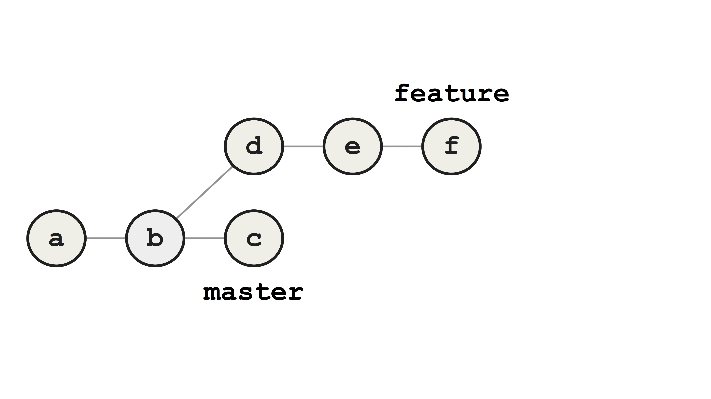
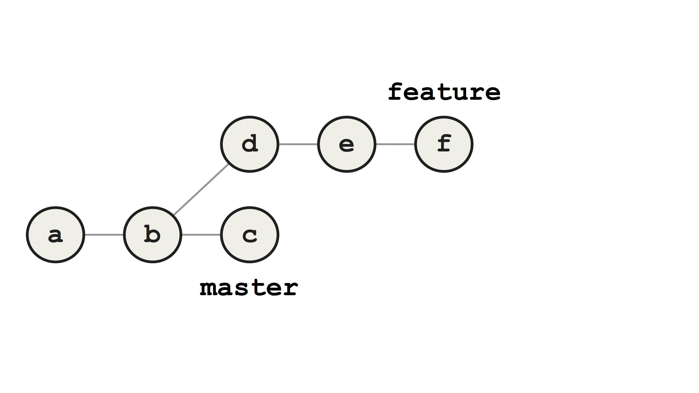
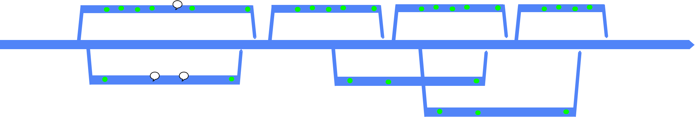

After using Git for several years, I found myself gradually using more and more advanced Git commands as part of my daily workflow. Soon after I discovered Git rebase, I quickly incorporated it into my daily workflow. Those who are familiar with rebasing know how powerful a tool it is, and how tempting it is to use it all the time. However, I soon discovered that rebasing presents some challenges that are not obvious when you first start doing it. Before presenting them, I'll quickly recap the differences between merging and rebasing.

Let's first consider the basic example where you want to integrate a feature branch with master. By merging, we create a new commit `g` that represents the merge between the two branches. The commit graph clearly shows what has happended, and we can see the contours of the "train track" graph familiar from larger Git-repos.

Alternatively, we could rebase before merging. The commits are removed and the `feature` branch is reset to `master`, after which the commits are re-applied on top of `feature`. The diffs of these re-applied commits are usually identical to their original counterparts, but they have *different* parent commits, and hence different SHA-1 keys.

We have now changed the base commit of `feature` from `b` to `c`, literally re-basing it.
Merging `feature` to `master` is now a fast-forward merge, because all commits on `feature` are direct descendants of `master`.

Compared to the merge approach, the resulting history is linear with no divergent branches. The improved readability was the reason I used to prefer rebasing branches before merging, and I expect this to be the case for other developers as well.

However, this approach has some challenges that may not be obvious.

Consider the case where a dependency that is still in use on `feature` has been removed on `master`. When `feature` is being rebased onto `master`, the first re-applied commit will break your build, but as long as there are no merge conflicts, the rebase process will continue uninterrupted. The error from the first commit will remain present in *all* subsequent commits, resulting in a chain of broken commits.

This error is only discovered after the rebase process is finished, and is usually fixed by applying a new bugfix commit `g` on top.

If you do get conflicts during rebasing however, Git will pause on the conflicting commit, allowing you to fix the conflict before proceeding. Solving conflicts in the middle of rebasing a long chain of commits is often confusing, hard to get right, and another source of potential errors.

Introducing errors is extra problematic when it happens during rebasing. This way, new errors are introduced when you rewrite history, and they may disguise genuine bugs that were introduced when history was first written. In particular, this will make it harder to use Git bisect, arguably the most powerful debugging tool in the Git toolbox. As an example, consider the following feature branch. Let's say we introduced a bug towards the end of the branch.

You may not discover this bug until weeks after the branch was merged to `master`. To find the commit that introduced the bug, you might have to search through tens or hundreds of commits. This process can be automated by writing a script that tests for the presence of the bug, and running it automatically through Git bisect, using the command `git bisect run <yourtest.sh>`.

Bisect will perform a bisection search through the history, identifying the commit that introduced the bug. In the example shown below, it succeeds in finding the first faulty commit, since all the broken commits contain the actual bug we are looking for.

On the other hand, if we've introduced additional broken commits during rebasing (here, `d` and `e`), bisect will run into trouble. In this case, we hope that Git identifies commit `f` as the bad one, but it erroneously identifies `d` instead, since it contains some other error that breaks the test.

This problem is greater than it may seem at first.

Why do we use Git at all? Because it is our most important tool for tracking down the source of bugs in our code. Git is our safety net. By rebasing, we give this less priority, in favour of the desire to achieve a linear history.

A while back, I had to bisect through several hundred commits to track down a bug in our system. The faulty commit was located in the middle of a long chain of commits that didn't compile, due to a faulty rebase a colleague had performed. This uneccessary and totally avoidable error resulted in me spending nearly a day extra in tracking down the commit.

So how can we avoid these chains of broken commits during rebasing?
One approach could be to let the rebase process finish, test the code to identify any bugs, and go back in history to fix the bugs where they were introduced. To this end, we could use interactive rebasing.

Another approach would be to have Git pause during every step of the rebase process, test for any bugs and fix them immediately before proceeding.

This is a cumbersome and error-prone process, and the only reason for doing it would be to achieve a linear history. Is there a simpler and better way?

There is; Git merge. It's a simple, one-step process, where all conflicts are resolved in a single commit. The resulting merge commit clearly marks the integration point between our branches, and our history depicts what _actually_ happened, and _when_ it happened.

The importance of keeping your history true should not be underestimated. By rebasing, you are lying to yourself and to your team. You pretend that the commits were written today, when they were in fact written yesterday, based on another commit. You've taken the commits out of their original context, disguising what actually happened. Can you be sure that the code builds? Can you be sure that the commit messages still make sense? You may believe that you are cleaning up and clarifying your history, but the result may very well be the opposite.

It's impossible to say what errors and challenges the future brings for your codebase. However, you can be certain that a *true* history will be more useful than a *rewritten* (or fake) one.

What motivates people to rebase branches?

I've come to the conclusion that it's about vanity. Rebasing is a purely aesthetic operation. The apparently clean history appeals to us as developers, but it can't be justified, from a technical nor functional standpoint.

Graphs of non-linear history, "train tracks", can be intimidating. They certainly felt that way to me to begin with, but there's no reason to be scared of them. There are many magnificent tools that can analyse and visualise complex Git history, both GUI- and CLI-based. These graphs contain valuable information about what has happened and when it happened, and we gain nothing by linearising it.

Git is made for, and encourages, non-linear history. If that puts you off you might be better off using a simpler VCS that only supports linear history.

I think you should keep your history true. Get comfortable with tools to analyse it, and don't fall for the temptation to rewrite it. The rewards for rewriting are minimal, but the risks are great. You'll thank me the next time you are bisecting through your history to track down a sneaky bug.

_Thanks to Paul Hammant and Aslak Hellesøy for valuable feedback on drafts of this post. Thanks to Paul Hammant for the figure of non-linear history. [His excellent site](https://trunkbaseddevelopment.com/short-lived-feature-branches/) is a highly recommended read. Special thanks to Aslak for encouraging me to write this post in the first place._

_This post is based on a talk given in Norwegian at JavaZone 2016: https://vimeo.com/182068915_
